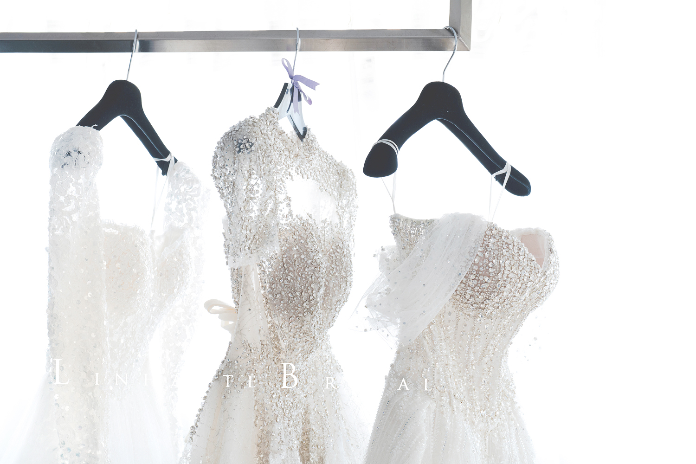

# 02.html RWD 實作指南

> 本文件提供 section-by-section 的具體修改方案，保持設計稿視覺不變，僅加入響應式支援

---

## 📦 修改清單

| Section | 原始問題 | 修改方案 | 優先級 |
|---------|---------|---------|--------|
| Header | 手機無漢堡選單、padding過大 | 已有 RWD，保持 | ✅ 完成 |
| Hero Banner | 固定高度、定位超出 | viewport height + 響應式定位 | 🔥 高 |
| 品牌介紹 | padding過大、背景破版 | 漸進式padding、隱藏背景 | 🔥 高 |
| 服務項目 | 固定寬度、無換行 | flex-wrap + 響應式寬度 | 🔥 高 |
| 婚紗禮服 | 圖片不縮放 | 響應式寬度 + flex-col | 🔥 高 |
| 婚禮實穿 | 固定Grid、圖片不縮 | Grid響應式 + auto height | 🔥 高 |
| 部落格 | 同服務項目 | 同服務項目方案 | 🔥 高 |
| 預約表單 | padding過大、Grid不換行 | 漸進式padding + grid-cols-1 | 🔥 高 |
| Footer | 微調對齊 | 已良好，保持 | ✅ 完成 |

---

## 🔧 Section 1: Hero Banner

### 原始程式碼 (02.html:279-290)

```html
<section class="w-full h-[880px] bg-cover bg-center bg-no-repeat relative flex items-center"
         style="background-image: url('images/banner/hero-banner-01.jpg');">
    <div class="absolute right-[219px] top-1/2 transform -translate-y-1/2 z-10 flex flex-col items-center">
        
        <nav class="flex items-center mt-[30px]">
            <a href="#" class="text-[#c09771] text-[14px] tracking-[0.10em] hover:opacity-80 transition-opacity duration-300">PREV</a>
            <span class="w-[40px] h-[1px] bg-white mx-[15px]"></span>
            <a href="#" class="text-white text-[14px] tracking-[0.10em] hover:opacity-80 transition-opacity duration-300">NEXT</a>
        </nav>
    </div>
</section>
```

### ✅ RWD 優化版本

```html
<section class="
    w-full
    h-[60vh] sm:h-[70vh] md:h-[80vh] lg:h-[880px]
    bg-cover bg-center bg-no-repeat
    relative flex items-center
" style="background-image: url('images/banner/hero-banner-01.jpg');">
    <!-- Logo & Navigation -->
    <div class="
        absolute
        right-4 sm:right-8 md:right-16 lg:right-[219px]
        top-1/2 -translate-y-1/2
        z-10
        flex flex-col items-center
        scale-75 sm:scale-85 md:scale-95 lg:scale-100
    ">
        

        <!-- Navigation - 手機隱藏 -->
        <nav class="hidden sm:flex items-center mt-[30px]">
            <a href="#" class="text-[#c09771] text-[14px] tracking-[0.10em] hover:opacity-80 transition-opacity duration-300">PREV</a>
            <span class="w-[40px] h-[1px] bg-white mx-[15px]"></span>
            <a href="#" class="text-white text-[14px] tracking-[0.10em] hover:opacity-80 transition-opacity duration-300">NEXT</a>
        </nav>
    </div>
</section>
```

**關鍵變更：**
1. `h-[60vh] sm:h-[70vh] md:h-[80vh] lg:h-[880px]` - 手機用 viewport height
2. `right-4 sm:right-8 md:right-16 lg:right-[219px]` - 響應式定位
3. `scale-75 sm:scale-85 md:scale-95 lg:scale-100` - Logo 縮放
4. `hidden sm:flex` - Nav 在手機隱藏

---

## 🔧 Section 2: 品牌介紹

### 原始程式碼 (02.html:293-352)

```html
<section class="relative bg-white">
    <!-- Backgrounds Layer -->
    <div class="absolute top-0 left-0 w-full h-full flex flex-col lg:flex-row">
        <div class="hidden lg:block lg:w-[calc(50%+100px)] h-full bg-cover bg-center bg-no-repeat"
             style="background-image: url('images/background/about-bg.jpg')"></div>
        <div class="w-full lg:w-[calc(50%-100px)] h-full bg-white"></div>
    </div>

    <!-- Content Layer -->
    <div class="relative max-w-[1920px] mx-auto px-4 sm:px-8 md:px-16 lg:px-[225px] py-20 lg:py-[135px]">
        ...
    </div>
</section>
```

### ✅ RWD 優化版本

```html
<section class="relative bg-white">
    <!-- Backgrounds Layer -->
    <div class="absolute top-0 left-0 w-full h-full flex flex-col lg:flex-row">
        <!-- 背景圖在手機隱藏，平板以上顯示 -->
        <div class="
            hidden lg:block
            lg:w-[calc(50%+100px)]
            h-64 lg:h-full
            bg-cover bg-center bg-no-repeat
        " style="background-image: url('images/background/about-bg.jpg')"></div>
        <div class="w-full lg:w-[calc(50%-100px)] h-full bg-white"></div>
    </div>

    <!-- Content Layer -->
    <div class="
        relative
        max-w-[1920px] mx-auto
        px-4 sm:px-8 md:px-12 lg:px-[100px] xl:px-[225px]
        py-12 sm:py-16 md:py-20 lg:py-[135px]
    ">
        <div class="flex flex-col lg:flex-row items-center gap-6 md:gap-10 lg:gap-[98px]">

            <!-- Left Content Block (圖片區域) - 手機顯示圖片 -->
            <div class="lg:w-[calc(50%+100px)] w-full lg:hidden">
                
            </div>

            <!-- Right Content Block (內容區域) -->
            <div class="lg:w-[calc(50%-100px)] w-full flex flex-col items-center px-4 lg:pl-[22px]">
                <!-- 品牌介紹標題區塊 -->
                <div class="flex flex-col items-center mb-8 lg:mb-[51px] relative w-full">
                    <div class="relative inline-block">
                        <h2 class="
                            text-[24px] md:text-[29px]
                            leading-none tracking-[0.15em]
                            text-text-main-title inline
                        ">
                            <span class="text-[30px] md:text-[35px] text-text-gold">品</span>
                            <span class="text-[24px] md:text-[29px] text-text-main-title">牌介紹</span>
                        </h2>
                        <!-- 裝飾圖在平板以上顯示 -->
                        
                    </div>
                    <div class="w-full max-w-[496px] border-b border-underline mt-[17px]"></div>
                </div>

                <!-- 副標題 -->
                <p class="
                    font-['Noto_Sans_HK']
                    text-[18px] md:text-[20px]
                    tracking-[0.124em]
                    text-text-subtitle
                    mb-[21px]
                    w-full text-center
                ">
                    LinHaute Bridal — 您好禮服
                </p>

                <!-- 主標題一 -->
                <h2 class="
                    font-['Noto_Sans_HK'] font-light
                    text-[15px] md:text-[17px]
                    leading-[21px]
                    tracking-[0.10em]
                    text-[#D3B599]
                    mb-[26px]
                    w-full text-left
                ">
                    婚紗，不只是禮服，更是女孩一生一次的夢想與儀式感
                </h2>

                <!-- 段落一 -->
                <p class="
                    font-['Noto_Sans_HK'] font-normal
                    text-[11px] md:text-[12px]
                    leading-[18px] md:leading-[20px]
                    tracking-[0.095em]
                    text-[#868686]
                    mb-[17px]
                    w-full text-left
                ">
                    每一件都像在等待，等一個屬於它的故事，可等一個屬於妳的時刻。<br>
                    我們將高級訂製與手工溫度交織在一起，為妳描繪修身的線條、輕盈的垂墜與<br class="hidden lg:block">
                    微醺的性感，把婚紗融入時裝的靈魂，那一刻穿上的，不只是「好看」，而是<br class="hidden lg:block">
                    「比妳想像中更美」。
                </p>

                <!-- 其他內容... -->
            </div>

        </div>
    </div>
</section>
```

**關鍵變更：**
1. `px-4 sm:px-8 md:px-12 lg:px-[100px] xl:px-[225px]` - 漸進式 padding
2. `hidden lg:block` - 背景圖在手機隱藏
3. `lg:hidden` - 手機版額外顯示圖片
4. `text-[24px] md:text-[29px]` - 響應式字體
5. `hidden md:block` - 裝飾圖在平板以上顯示

---

## 🔧 Section 3: 服務項目

### 原始程式碼 (02.html:358-406)

```html
<div class="w-full max-w-[1920px] flex flex-col md:flex-row justify-center items-center md:items-stretch gap-[17px] px-4 sm:px-8 md:px-16 lg:px-[225px]">
    <!-- Card 1 -->
    <div class="group w-full max-w-[385px] md:w-[385px] h-[387px] shrink-0 rounded-[9px] ...">
        ...
    </div>
    <!-- Card 2, 3... -->
</div>
```

### ✅ RWD 優化版本

```html
<div class="
    w-full max-w-[1920px]
    flex flex-col md:flex-row flex-wrap
    justify-center items-center md:items-stretch
    gap-4 md:gap-[17px]
    px-4 sm:px-8 md:px-12 lg:px-[100px] xl:px-[225px]
">
    <!-- Card 1 -->
    <div class="
        group
        w-full sm:w-[calc(50%-8px)] lg:w-[385px]
        max-w-[500px] lg:max-w-[385px]
        h-auto md:h-[387px]
        shrink-0
        rounded-[9px]
        shadow-[0_2px_7px_rgba(0,0,0,0.08)]
        flex flex-col items-center text-center
        transition-colors duration-300
        overflow-hidden
        bg-card-bg hover:bg-white
    ">
        

        <h3 class="
            text-[16px] md:text-[17px]
            tracking-[0.10em]
            text-text-main-title
            mt-[21px] mb-[26px]
            px-4
        ">
            白紗 & 晚禮服租借
        </h3>

        <p class="
            text-[13px] md:text-[14px]
            leading-6
            tracking-[0.10em]
            text-text-subtitle
            px-[17px]
            grow
        ">
            可自由選擇「單租」或是「包套」
        </p>

        <a href="#" class="
            w-full h-[64px] md:h-[74px]
            mt-[26px]
            flex justify-center items-center
            text-[13px] md:text-[14px]
            tracking-[0.10em]
            no-underline text-text-gold
            transition-colors duration-300
            rounded-b-[9px]
            group-hover:bg-btn-bg group-hover:text-white
        ">
            <span>瀏覽禮服照片</span>
            <i class="fas fa-chevron-right ml-2.5"></i>
        </a>
    </div>

    <!-- Card 2, 3... (同樣修改) -->
</div>
```

**關鍵變更：**
1. `flex-wrap` - 允許卡片換行
2. `w-full sm:w-[calc(50%-8px)] lg:w-[385px]` - 手機全寬、平板兩欄、桌機固定寬
3. `h-auto md:h-[387px]` - 手機自動高度
4. `w-[140px] md:w-[188px]` - 圖示響應式大小
5. `text-[16px] md:text-[17px]` - 響應式文字

---

## 🔧 Section 4: 婚紗禮服

### 原始程式碼 (02.html:408-450)

```html
<div class="lg:w-1/2 flex flex-col items-center">
    <div class="flex flex-col sm:flex-row gap-4 mb-[17px]">
        
        
    </div>
</div>
```

### ✅ RWD 優化版本（已正確）

保持原有結構，已經有良好的 RWD：
- `flex-col sm:flex-row` - 正確
- `w-full max-w-[320px] sm:w-[280px] lg:w-[293px]` - 正確
- `h-auto` - 正確

**無需修改**

---

## 🔧 Section 5: 婚禮實穿

### 原始程式碼 (02.html:452-492)

```html
<section class="relative h-[1114px] overflow-hidden">
    ...
    <div class="flex gap-[9px] mb-[51px]">
        
        
        <div class="flex flex-col gap-[9px]">
            
            
        </div>
    </div>
</section>
```

### ✅ RWD 優化版本

```html
<section class="
    relative
    h-auto lg:h-[1114px]
    py-12 md:py-16 lg:py-0
    overflow-hidden
">
    <!-- 上方背景圖 -->
    

    <!-- 下方背景圖 -->
    

    <!-- 內容 -->
    <div class="relative z-10 flex flex-col items-center pt-[80px] md:pt-[150px] lg:pt-[227px] px-4 md:px-8">
        <!-- 標題區域 -->
        <div class="flex flex-col items-center mb-8 lg:mb-[51px] relative">
            <div class="relative inline-block">
                <h2 class="
                    text-[24px] md:text-[29px]
                    leading-none tracking-[0.15em]
                    text-text-main-title inline
                ">
                    <span class="text-[30px] md:text-[35px] text-text-gold">婚</span>
                    <span class="text-[24px] md:text-[29px] text-text-main-title">禮實穿</span>
                </h2>
                
            </div>
            <div class="w-full max-w-[496px] border-b border-underline mt-[17px]"></div>
        </div>

        <!-- 副標題 -->
        <p class="
            text-[18px] md:text-[20px]
            tracking-[0.124em]
            text-text-subtitle
            mb-8 lg:mb-[51px]
        ">
            講究禮服與宴會氛圍的契合
        </p>

        <!-- 圖片區域 - Grid 響應式 -->
        <div class="
            grid
            grid-cols-1 sm:grid-cols-2 lg:grid-cols-3
            gap-2 md:gap-[9px]
            mb-8 lg:mb-[51px]
            w-full max-w-[1200px]
        ">
            <!-- 左邊兩張 -->
            

            

            <!-- 右邊一上一下 -->
            <div class="
                col-span-1 sm:col-span-2 lg:col-span-1
                flex flex-col gap-2 md:gap-[9px]
            ">
                

                
            </div>
        </div>

        <!-- 按鈕 -->
        <a href="#" class="
            inline-flex items-center justify-center
            w-[110px] md:w-[122px]
            h-[34px] md:h-[36px]
            bg-transparent border border-[#C09771]
            text-btn-bg
            text-[13px] md:text-[14px]
            tracking-[0.10em]
            no-underline rounded-full
            cursor-pointer
            transition-colors duration-300
            hover:bg-btn-bg hover:text-white
        ">
            瀏覽更多 <i class="fas fa-chevron-right ml-2.5"></i>
        </a>
    </div>
</section>
```

**關鍵變更：**
1. `h-auto lg:h-[1114px]` - 手機自動高度
2. `grid grid-cols-1 sm:grid-cols-2 lg:grid-cols-3` - 響應式 Grid
3. `col-span-1 sm:col-span-2 lg:col-span-1` - 右側區塊跨欄
4. `w-full lg:w-[377px]` - 響應式寬度
5. `h-auto lg:h-[565px]` - 響應式高度
6. `px-4 md:px-8` - 手機加 padding

---

## 🔧 Section 6: 預約表單

### 原始程式碼 (02.html:614-745)

```html
<div class="bg-[#F9F5F1] px-[240px] pt-[51px] pb-[68px] rounded-b-[9px]">
    <div class="grid grid-cols-1 md:grid-cols-2 gap-x-[51px] gap-y-[18px]">
        ...
    </div>
</div>
```

### ✅ RWD 優化版本

```html
<div class="
    bg-[#F9F5F1]
    px-4 sm:px-8 md:px-12 lg:px-[120px] xl:px-[240px]
    pt-8 md:pt-[51px]
    pb-12 md:pb-[68px]
    rounded-b-[9px]
">
    <!-- 兩欄 Grid 布局 -->
    <div class="
        grid
        grid-cols-1 md:grid-cols-2
        gap-x-4 md:gap-x-[51px]
        gap-y-4 md:gap-y-[18px]
    ">
        <!-- Form Fields... -->
    </div>
</div>
```

**關鍵變更：**
1. `px-4 sm:px-8 md:px-12 lg:px-[120px] xl:px-[240px]` - 漸進式 padding
2. `grid-cols-1 md:grid-cols-2` - 手機單欄、平板雙欄
3. `gap-x-4 md:gap-x-[51px]` - 響應式間距

---

## 📊 RWD Classes 總結表

| 用途 | Mobile (< 640px) | Tablet (640-1024px) | Desktop (1024px+) |
|------|-----------------|-------------------|------------------|
| **Container Padding** | `px-4` | `sm:px-8 md:px-12` | `lg:px-[100px] xl:px-[225px]` |
| **Section Padding Y** | `py-12` | `sm:py-16 md:py-20` | `lg:py-[135px]` |
| **Card Width** | `w-full` | `sm:w-[calc(50%-8px)]` | `lg:w-[385px]` |
| **Grid Columns** | `grid-cols-1` | `sm:grid-cols-2` | `lg:grid-cols-3` |
| **Flex Direction** | `flex-col` | `md:flex-row` | - |
| **Text Size** | `text-[24px]` | `md:text-[29px]` | - |
| **Image Size** | `w-full h-auto` | `sm:w-[280px]` | `lg:w-[377px] h-[565px]` |
| **Visibility** | `hidden` | `md:block` | - |

---

## ✅ 下一步行動

1. **套用修改**：依照本文件逐 Section 修改 02.html
2. **測試驗證**：在以下斷點測試
   - 375px (iPhone SE)
   - 640px (sm)
   - 768px (md / iPad)
   - 1024px (lg)
   - 1440px (xl)
3. **微調細節**：根據實際效果調整間距和大小

**預期結果**：保持 02.html 的精準設計，但在所有螢幕尺寸都能正常顯示，無橫向滾動。
